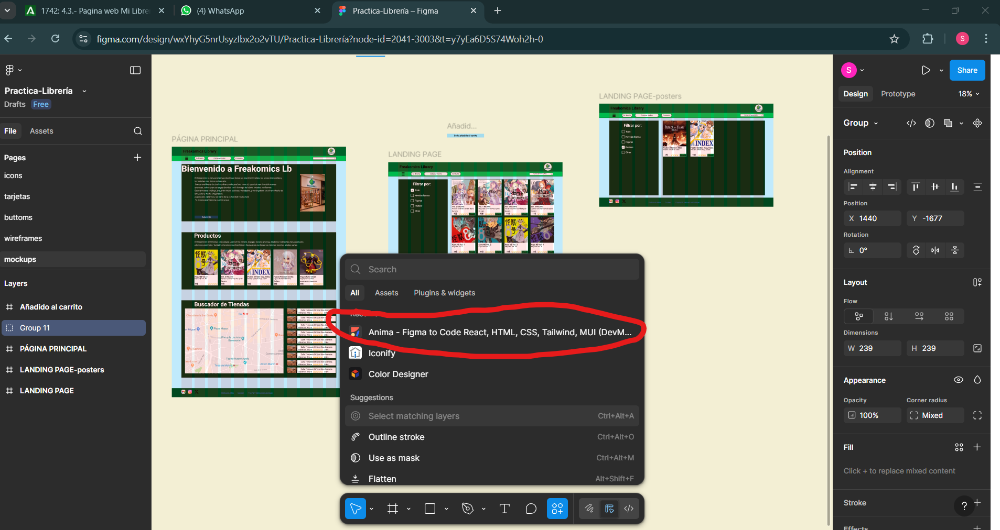
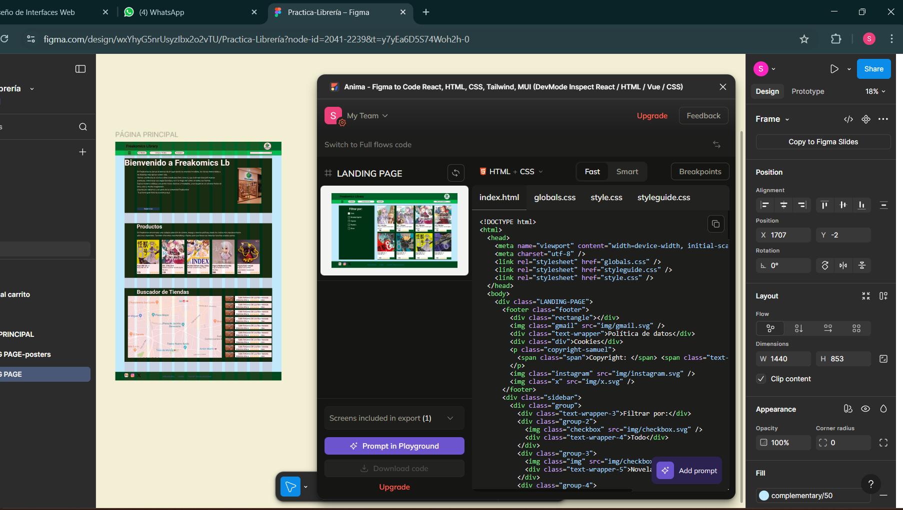
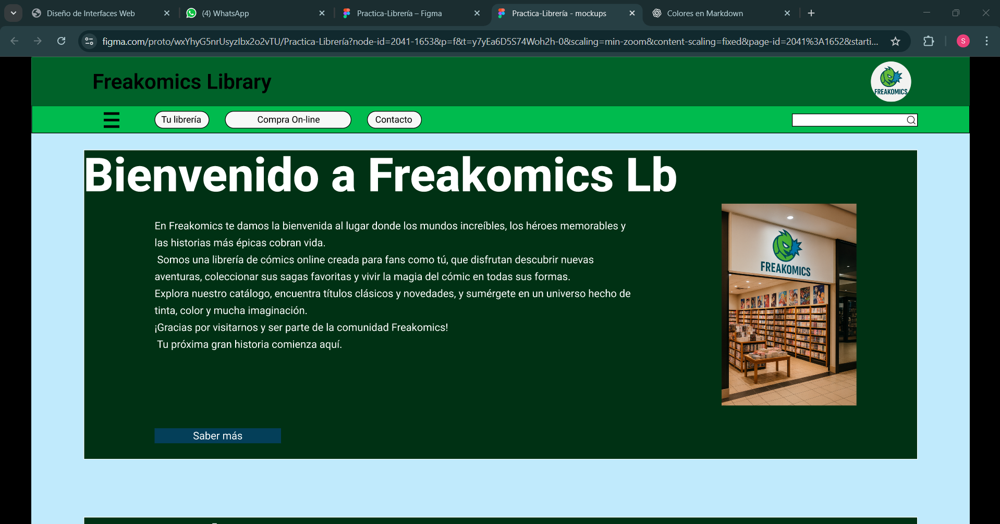
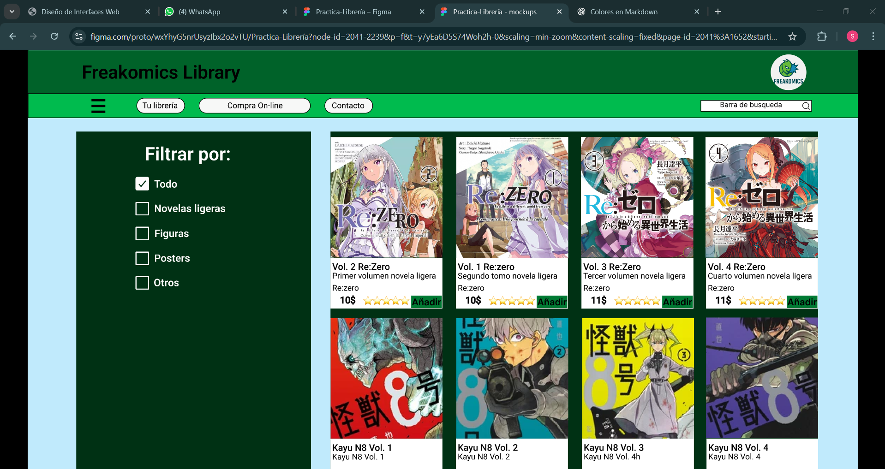
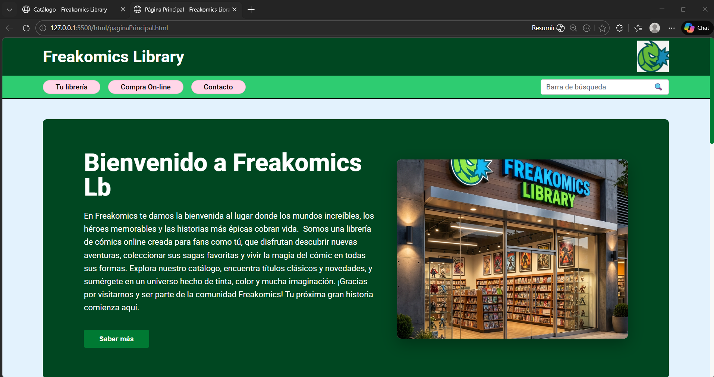
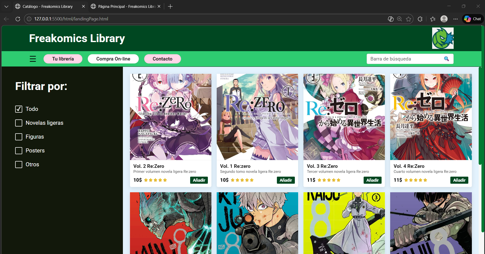

4. Requisitos Específicos
Apartado 1: Página Principal
A. Pantallas tipo Tablet (601px - 1024px)
Cabecera: El logotipo y el nombre de la empresa deben separarse (uno a la izquierda y otro a la derecha). En Desktop deben permanecer centrados.

Logotipo (Opcional): Se recomienda reducir su tamaño para optimizar el espacio.

Barra de navegación: El buscador debe posicionarse debajo del menú principal. El menú se mantiene en horizontal.

Pie de página: Las tres secciones de información se mantendrán en horizontal, ajustando su tamaño.

B. Pantallas tipo Móvil (Hasta 600px)
Estructura General: Todas las secciones (cabecera, barra de navegación y pie) deben pasar a una disposición vertical.

Navegación (Menú de Hamburguesa):

El menú de navegación horizontal debe desaparecer.

En su lugar, aparecerá un icono de menú (hamburguesa).

Al interactuar con el icono (clic), se deberá mostrar el menú en formato lista vertical.

Buscador: Se situará de forma independiente debajo de la cabecera o del menú desplegado.

Apartado 2: Página de Productos
A. Pantallas tipo Tablet
Cabecera y Navegación: Mismo comportamiento que en la Home.

Zona de Contenidos: Estas secciones se "apilan". La columna lateral pasa a estar arriba o debajo del contenido principal, ocupando todo el ancho.

Catálogo: A diferencia del móvil (donde va uno por uno), en tablet se deben seguir viendo en filas (por ejemplo, 2 o 3 productos por línea).

B. Pantallas tipo Móvil
Visibilidad: El logotipo de la empresa debe ocultarse para ganar espacio vertical.

Menú: Aplicar el mismo sistema de menú de hamburguesa definido en el Apartado 1.

Catálogo de Productos: Los productos deberán apilarse verticalmente (un único producto por fila, ocupando el ancho disponible).

# Orden de lo qe se ha hecho

1.  Descargué un plugin de figma para adquirir en forma de codigo html y css lo hecho en esta aplicación para así poder pasarlo y empezar desde ahí.

2. Al principio parecía funcionar pero no se consiguió un resultado bueno, ya que daba fallos y la IA tardaba mucho en leer los archivos , editar o los hacía mal.
No hay imagenes, me olvidé de coger capturas y descargar

3. Se optó al final por subir capturas de pantalla de figma y usarlas para crear la página web.Esto resultóo ser más rapido y facil de editar que el anterior intento.

## Imagen de figma

<a href="https://www.figma.com/design/wxYhyG5nrUsyzIbx2o2vTU/Practica-Librer%C3%ADa?node-id=2041-1652&t=y7yEa6D5S74Woh2h-1">>>>>>>>ENLACE FIGMA<<<<<<<</a>
## Imagen de la página web

